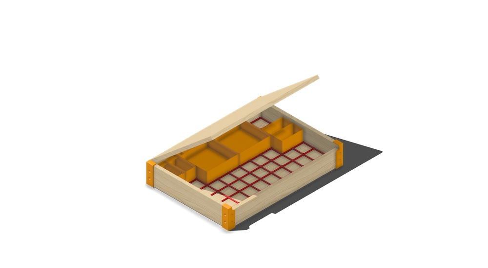
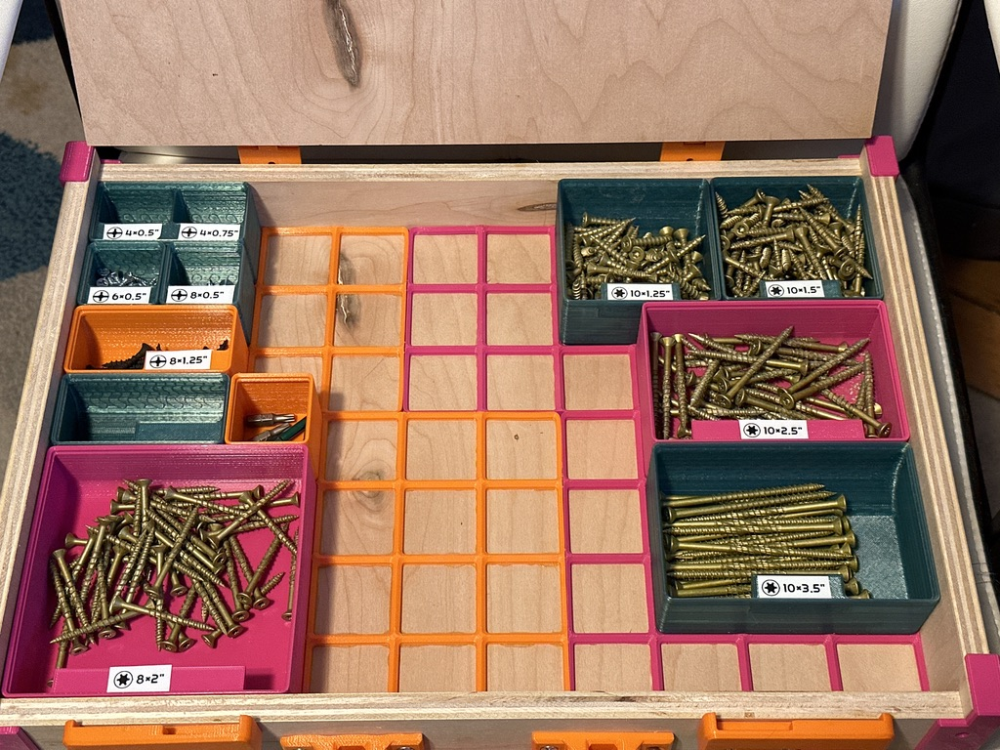

# Gridfinity Small Parts Organizer

Organize your small parts in a modular and customizable version of the [small parts](https://www.google.com/search?q=small+parts+case&client=safari&rls=en&sxsrf=ALiCzsbUx1lB4aglwNJBPvPJqoJsWEnsCg:1672631170434&source=lnms&tbm=isch&sa=X&ved=2ahUKEwjyzoPW_Kf8AhULFlkFHUXHCboQ_AUoAnoECAEQBA&biw=2497&bih=1312&dpr=1) cases that are readily available at any hardware store. Why make it yourself when you could buy it for a fair price? Do you even understand 3D printing?! We do it because we can.

## Inspiration
This project combines several existing works:
- Alexandre Chappel's [Assortment Boxes](https://youtu.be/VntGnLuwoeY)
- Zack Freedman's [Gridfinity system](https://www.youtube.com/watch?v=ra_9zU-mnl8)
- Kennetek's OpenSCAD [Gridfinity Rebuilt](https://github.com/kennetek/gridfinity-rebuilt-openscad) project.

If you want to keep things simple, Chappel has a great set of [plans and STLs](https://www.alch.shop/shop/assortment) for his Assortment system. This is a great solution if you don't want too much customization. However, the Gridfinity platform has **HUGE** community support with a large number of mods, derivatives, and compatible parts. I wanted to use the Chappel box idea, but with the Gridfinity system inside.

## The Details
> [Get the cut list here!](Cut%20List.pdf)
-  This is a `7x10x6u` grid.
    - I picked the size by looking at other small parts boxes and trying to come up with a similar dimension.
    - This allows for a lot of layout flexibility and allows the bins to hold plenty of screws without getting too bulky.
    - If you want to adjust the base dimensions, just add or remove `42mm` in any direction of the cut list.
- The short edges are proud (up to the level of the lid) to prevent small parts from slipping through a gap between the lid and the sides.
- The lid rests on top of the long edges (where it attaches with hings and latches)
- With the lid closed, you can shake the box any way you like! Nothing should fall out of place.

Since my latches are part of [Chappel's paid plans](https://www.alch.shop/shop/p/assortment-case), I will not include STLs here. You are welcome to purchase his (for a very reasonable price) or come up with your own.

